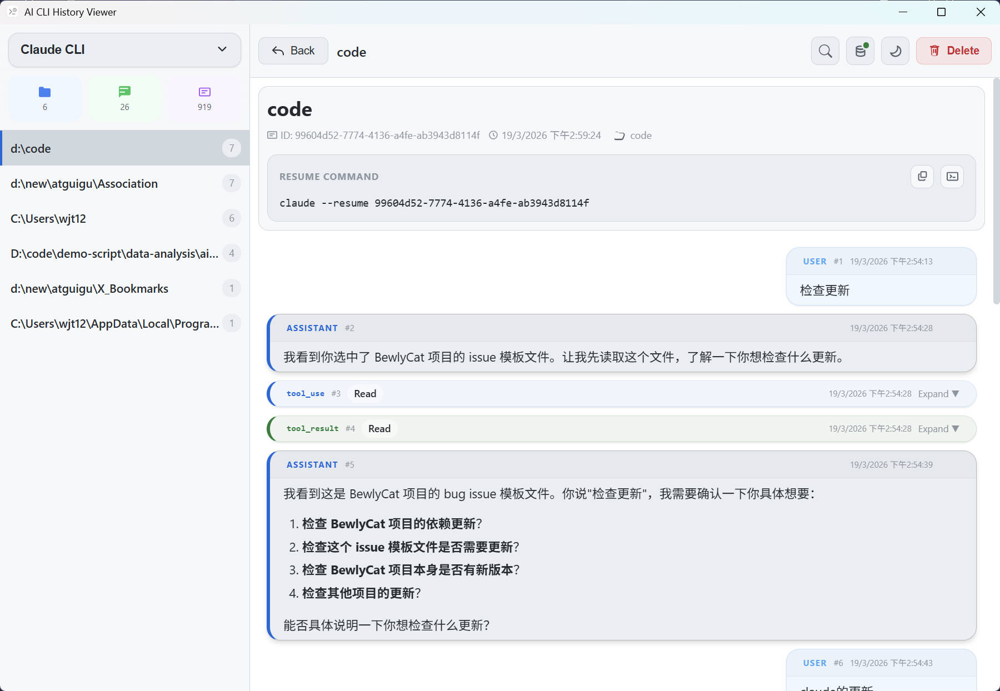
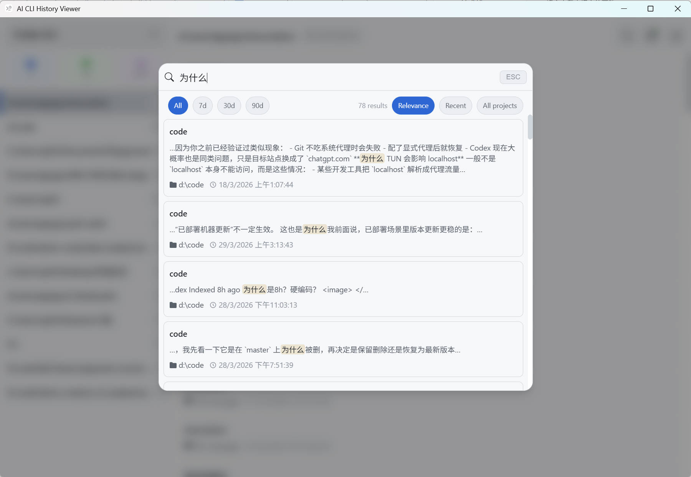
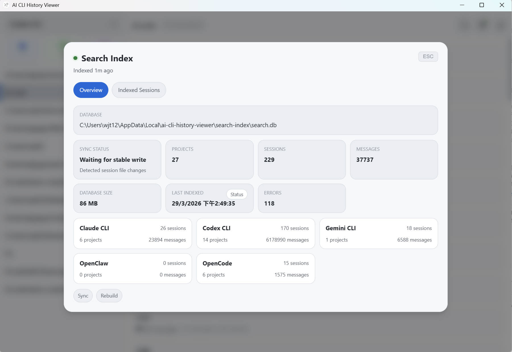
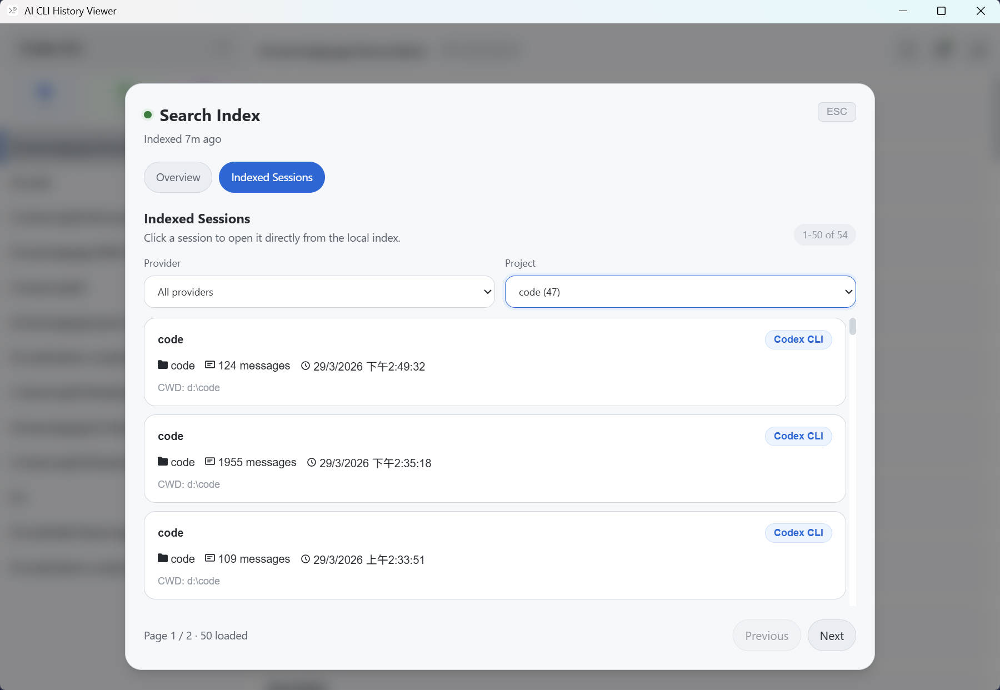

# ACLIV (Rust + Tauri)

基于 Tauri 2 + Rust + Svelte 5 的 AI CLI 会话历史查看器。
```
演示地址：http://122.152.227.241:17860/
账号：admin
密码：308a46225b4f0eb0fa52dc4e47bf5a41a271583555bbba2963e21965ff4c462a
```
功能

- 支持多 Provider：`claude`、`codex`、`gemini`、`openclaw`、`opencode`
- 会话列表统一扫描，按最近活跃时间排序
- 点击会话按需加载消息详情
- 支持暗色/亮色主题切换
- Markdown 渲染与复制按钮
- 支持 Linux Web 模式（默认端口 `17860`）

## Screenshots

| Main Overview | Search Dialog |
| :-----------: | :-----------: |
|  |  |

| Search Index Panel | Session Detail |
| :----------------: | :------------: |
|  |  |

## 当前架构

后端已迁移到统一 `session_manager` 架构：

- `list_sessions`：扫描全部 provider，返回标准化 `SessionMeta[]`
- `get_session_messages`：按 `providerId + sourcePath` 加载消息
- `launch_session_terminal`：Windows 下启动终端执行恢复命令
- `acliv-web`：独立 Web 入口（`/api/*`），复用同一套 `session_manager`


## 技术栈

- Desktop: Tauri 2
- Backend: Rust (`serde`, `serde_json`, `chrono`, `regex`, `dirs`)
- Frontend: Svelte 5 + Vite
- Markdown/Security: `marked` + `highlight.js` + `DOMPurify`

## 开发

环境要求：

- Node.js 18+
- Rust stable
- repo 内置 `@tauri-apps/cli`，直接用 `npm exec tauri ...`

安装依赖：

```bash
npm install
```

开发运行：

```bash
npm exec tauri dev
```

构建：

```bash
npm exec tauri build -- --no-bundle
```

本地重编并直接启动桌面版时，使用上面的 Tauri 构建链路；不要用 `cargo build` 代替桌面构建。

发布打包：

```powershell
powershell -NoProfile -ExecutionPolicy Bypass -File .\scripts\build-release.ps1 -Version <x.y.z>
```

## Linux 部署

一键部署
```bash
curl -fsSL https://raw.githubusercontent.com/occva/acliv/master/deploy/install.sh | sudo env ACLIV_REPO_BRANCH=master bash
```

安装脚本会自动：

- 生成 Web 登录账号密码（默认账号 `admin`）
- 探测常见 provider 历史目录并写入部署配置
- 拉取 GHCR 预构建镜像并启动服务
- 输出访问地址和登录凭据

## 项目结构

```text
.
├── assets/
│   └── screenshots/              # README 截图资源
├── deploy/                       # Docker 与 Linux 安装脚本
├── docs/                         # 设计、重构、发布与部署文档
├── public/
│   └── css/style.css             # 主界面样式
├── scripts/                      # 构建/发布辅助脚本
├── src/                          # Svelte 前端
│   ├── App.svelte                # 主界面与交互逻辑
│   ├── main.ts
│   └── lib/
│       ├── api.ts                # Tauri/Web API 适配层
│       └── components/
│           └── Markdown.svelte   # Markdown / Mermaid 渲染
├── src-tauri/
│   ├── src/
│   │   ├── lib.rs                # Tauri 入口与命令注册
│   │   ├── main.rs               # Desktop 启动入口
│   │   ├── cmd.rs                # Tauri commands
│   │   ├── watcher.rs            # 本地 session 文件监听与索引同步
│   │   ├── paths.rs              # 各 CLI 默认目录解析
│   │   ├── bin/
│   │   │   └── acliv-web.rs      # Web 模式入口（二进制）
│   │   ├── session_manager/      # 统一 provider 扫描与消息读取
│   │   │   ├── mod.rs
│   │   │   └── providers/        # claude/codex/gemini/openclaw/opencode
│   │   └── search_index/         # SQLite 全文索引、查询与状态管理
│   │       ├── mod.rs
│   │       ├── indexer.rs
│   │       ├── query.rs
│   │       ├── schema.rs
│   │       └── status.rs
│   └── tauri.conf.json
├── .github/
│   └── workflows/                # CI / release workflow
└── package.json
```

## License

MIT
